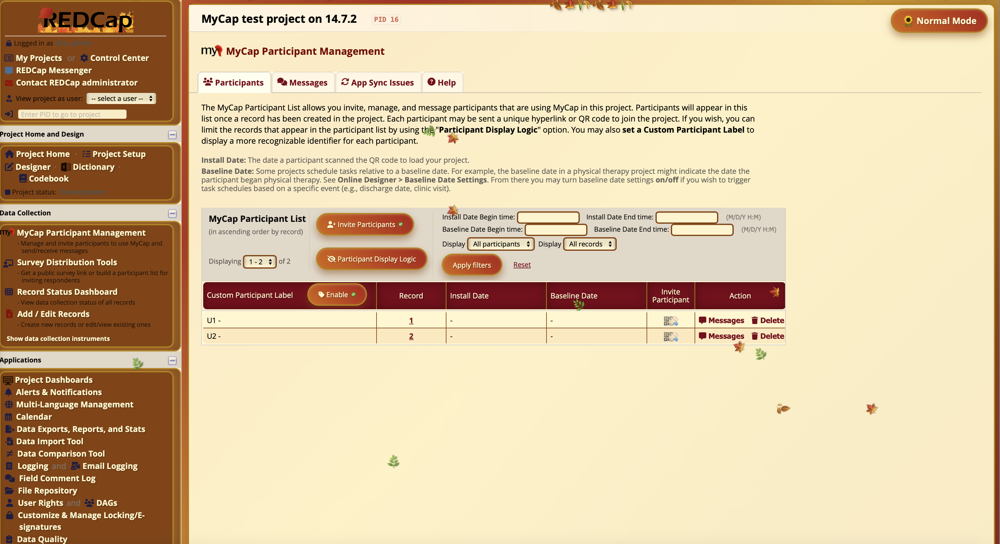

# REDCap Fall & Thanksgiving Mode External Module

Transform your REDCap instance into a beautiful autumn landscape! This external module brings the warmth and beauty of fall season to your data collection with rich harvest colors, falling leaves, and Thanksgiving spirit.

*REDCap with Fall & Thanksgiving Mode enabled - showcasing the warm autumn theme with falling leaves animation and harvest colors throughout the interface.*

## Features

### 🍂 Visual Themes
- **Autumn Color Palette**: Warm oranges, deep reds, golden yellows, and rich browns
- **Harvest Gradients**: Beautiful fall-themed gradient backgrounds
- **Seasonal Typography**: Burgundy headers with autumn leaf animations
- **Warm Border Styling**: Gold borders and fall-themed decorations

### 🍁 Interactive Elements
- **Falling Leaves Animation**: Configurable autumn leaf effects across all pages
- **Toggle Button**: Easy-to-use Fall mode on/off switch
- **Harvest Interactions**: Delightful hover effects on buttons and links
- **Thanksgiving Mode**: Extra festive elements for November celebrations

### 🎃 Customization Options
- **Theme Intensity**: Choose from Subtle or Full Intensity levels
- **Leaves Control**: Enable/disable falling leaf animations
- **Thanksgiving Mode**: Turkey and harvest decorations
- **Pumpkin Spice Mode**: Extra warm color filtering for cozy autumn feel
- **Project-Level Settings**: Configure Fall mode per project
- **Global Settings**: System-wide Fall mode control

## Installation

1. Copy the `fall_thanksgiving_mode_v1.0.0` folder to your REDCap `modules/` directory
2. Navigate to Control Center > External Modules
3. Enable the "REDCap Fall & Thanksgiving Mode" module
4. Configure your preferred settings

## Configuration

### System Settings
- **Enable Fall & Thanksgiving Mode globally**: Apply autumn theme to all REDCap pages
- **Allow user toggle**: Let users turn Fall mode on/off with the toggle button
- **Fall theme intensity**: Choose the level of autumn styling (Subtle/Full Intensity)

### Project Settings
- **Enable Fall & Thanksgiving Mode for this project**: Project-specific autumn theme
- **Enable falling leaves animation**: Add beautiful leaf fall effects
- **Enable Thanksgiving mode**: Turkey, corn, and harvest decorations
- **Enable Pumpkin Spice mode**: Warm color filtering for extra autumn coziness

## How It Works

The module uses the `redcap_every_page_top` hook to inject Fall-themed CSS and JavaScript into every page. It includes:

- CSS variables for consistent autumn theming
- Responsive design that works across all REDCap interfaces
- Local storage to remember user preferences
- Smooth leaf animations and transitions
- Cross-browser compatibility
- Performance-optimized falling leaves

## Fall Theme Features

### 🎨 Color Scheme
- **Primary Colors**: Chocolate orange, fire brick red, golden rod yellow
- **Secondary Colors**: Saddle brown, burgundy, dark golden rod
- **Accent Colors**: Beige cream for backgrounds and text contrast

### 🍃 Animations
- **Falling Leaves**: Multiple leaf types with realistic physics
- **Flutter Effect**: Headers with gentle leaf movement
- **Bounce Animation**: Thanksgiving decorations with harvest spirit
- **Gentle Sway**: Natural leaf movement patterns

### 🦃 Special Modes
- **Thanksgiving Mode**: 🦃 🌽 🥧 🍁 🎃 🥕 🌾 🍂 decorations
- **Pumpkin Spice Mode**: Warm color filtering for cozy autumn atmosphere

## Browser Compatibility

- Chrome/Chromium (recommended)
- Firefox
- Safari
- Edge

## Performance

- Optimized leaf animations (20 leaves max per batch)
- Longer intervals for natural feel (20-second cycles)
- Efficient DOM cleanup
- Non-blocking pointer events

## Compatibility

- **REDCap Version**: 8.0.0 or higher
- **PHP Version**: 5.6.0 or higher
- **Framework**: External Modules Framework v15

## Changelog

### Version 1.0.0
- Initial release with full autumn theming
- Falling leaves animations with multiple leaf types
- Thanksgiving and Pumpkin Spice modes
- Configurable theme intensity
- Toggle functionality with local storage
- Performance optimizations

## Support

For questions, bug reports, or feature requests, please contact your REDCap administrator.

## License

This module is provided as-is for educational and seasonal purposes. Happy Thanksgiving! 🦃

---

*May your data be as rich as autumn harvests and your surveys as colorful as fall foliage!* 🍂🎃